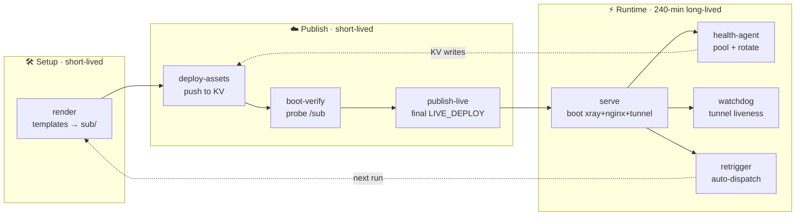
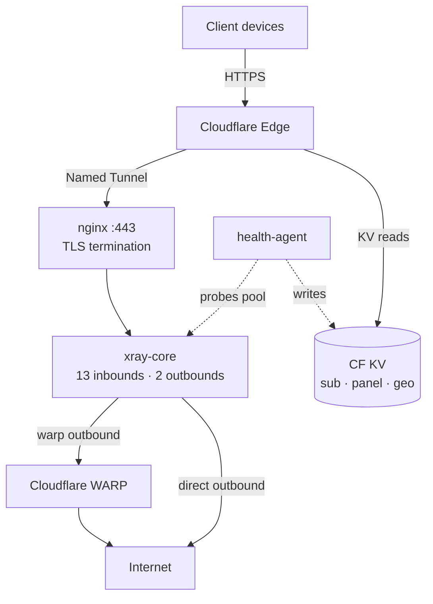

# 🇺🇳 Gayroxy — Multi-Protocol Proxy Suite

[](https://github.com/USERNAME/gayroxy/actions/workflows/main.yml)

**Self-hosted, multi-protocol proxy over Cloudflare Tunnel. Runs 24/7 on GitHub Actions for free.**

---

## 🌟 Features

| Protocol | Transport | TLS | Use Case |
|----------|-----------|-----|----------|
| VLESS / Trojan / VMess | WebSocket | ✅ | Browsers, mobile apps |
| VLESS / Trojan / VMess / Shadowsocks | gRPC | ✅ | HTTP/2 multiplexing |
| VLESS / Trojan / VMess | HTTPUpgrade | ✅ | Simpler than WS, works through nginx |
| Shadowsocks | Direct (local) | — | High performance |
| VLESS Reality | Direct (local) | — | Stealth, no cert needed |
| SOCKS5 / HTTP | Local | — | System proxy |

**Extra:**
- 🌍 **GeoIP/GeoSite databases** (Iran rules) served at `/geo/`
- 📱 **Web panel** at `/panel` with QR codes & config cards
- 🔗 **External subscription merging** — combine multiple subs into one
- 🛡️ **WARP integration** — Reddit traffic via residential IPs
- 🎲 **Stealth randomization** — each run varies timing & identity

---

## 🚀 Quick Start

### 1. Fork this repo

```bash
# Fork on GitHub, then:
git clone https://github.com/YOUR_USERNAME/gayroxy.git
cd gayroxy
```

### 2. Add Secrets

Go to **Settings → Secrets and variables → Actions**.

| Secret | Required | Description |
|--------|:--------:|-------------|
| `CF_TOKEN` | ✅ | Cloudflare API token — **Workers Scripts:Edit**, **Workers KV Storage:Edit**, **Account Settings:Read**. Add **Cloudflare Tunnel:Edit + Zone:Read + DNS:Edit** for the automatic named tunnel (stable domain). |
| `GH_TOKEN` | ✅ | GitHub PAT with `repo` + `workflow` scope. Required — the auto-retrigger + keepalive dispatch the next run with it (a PAT outlives the built-in `GITHUB_TOKEN` and has higher rate limits). |
| `EXTERNAL_SUB_URLS` | ❌ | Comma-separated external subscription URLs; panel-managed sources are stored in Worker KV. If unset, the built-in v2raycollector source is used. |

**Just two secrets — that's it.** There are **two tunnel modes**:

- **Named tunnel (fully automatic, stable configs):** with `CF_TOKEN` set, the
  proxy runs on your **own stable hostname** — `serve.sh` (plus the scripts under
  `scripts/`) does everything at
  boot via the CF API: picks the first account + the first active zone, derives
  the fixed hostname `gaaayroxy.<zone>`, creates-or-reuses
  the tunnel, and points DNS at it (CNAME, proxied). No domain or tunnel-token
  secrets needed. The hostname never changes across runs → users import
  **once** and stay valid forever.
- **Quick tunnel (zero-config fallback):** if `CF_TOKEN` is unset, or the
  account has no zone / the token lacks permissions, it falls back to a free
  random `trycloudflare.com` URL (rotated every run, published to the Worker
  within seconds of boot).

Static assets are always served from a **Cloudflare Worker + KV** you own,
not GitHub Pages.

**Create `CF_TOKEN`** ([Cloudflare Dashboard → My Profile → API Tokens → Create Token](https://dash.cloudflare.com/profile/api-tokens)) with these permissions:

| Scope | Permission |
|-------|-----------|
| Account | Workers Scripts:Edit |
| Account | Workers KV Storage:Edit |
| Account | Account Settings:Read |
| Account | Cloudflare Tunnel:Edit — for the automatic **named tunnel** (lets `scripts/serve.sh` create/reuse the tunnel + fetch its token) |
| Zone (pick your zone) | Zone:Read + DNS:Edit — for the automatic named tunnel's DNS route |
| Zone (optional) | Workers Routes:Edit + DNS:Edit — only if you want a **custom domain** for the panel/sub (see step 3) |

```bash
gh secret set CF_TOKEN        # paste the token
gh secret set GH_TOKEN        # required PAT (repo + workflow scope)
# That's it — no domain/tunnel-token secrets needed.
```

### 3. (Optional) Custom domain for the panel/sub

By default everything is served at `https://gayroxy.<your-subdomain>.workers.dev`
(the exact URL is printed on every deploy and saved as the `WORKER_URL` repo
variable). To use your own static domain — e.g. `proxy.example.com`
serving `/sub`, `/sub.txt`, `/panel`, `/index.html`, `/geo/*` — set the repo
variable:

```bash
gh variable set WORKER_DOMAIN --body "proxy.example.com"
```

`deploy-cf.sh` then binds it as a **Workers Custom Domain** on every deploy:
Cloudflare creates the DNS record and a managed TLS certificate automatically,
and the free plan fully supports it. Prerequisites:

- The zone (`example.com`) must be active on the **same Cloudflare account**
  (nameservers pointed at Cloudflare, or a CNAME setup) — otherwise the zone
  lookup fails and the custom domain is skipped with a warning.
- The token needs the Zone permissions from step 2 (Workers Routes:Edit +
  DNS:Edit + Zone:Read).

> Legacy alternative: `gh variable set WORKER_ROUTE --body "sub.your-domain.com"`
> creates a plain Workers Route instead (you must add the DNS record yourself:
> `sub → gayroxy.<subdomain>.workers.dev`, Proxied 🟠). Prefer `WORKER_DOMAIN` —
> it does the DNS + TLS for you.

### 4. Push & Deploy

```bash
git add -A
git commit -m "Initial deploy"
git push
```

The workflow runs immediately: the render job publishes the static assets to
Cloudflare within ~2 minutes, the proxy job boots the tunnel, publishes the
live tunnel URL, and re-triggers itself 24/7.

### 5. Access

| URL | Description |
|-----|-------------|
| `https://gayroxy.<sub>.workers.dev/sub.txt` | Merged subscription (text/plain — opens in browser) |
| `https://gayroxy.<sub>.workers.dev/sub` | Merged subscription (base64 — for proxy clients) |
| `https://gayroxy.<sub>.workers.dev/panel` | Web panel with QR codes (always-on via Worker+KV) |
| `https://gayroxy.<sub>.workers.dev/geo/Country.mmdb` | GeoIP for Shadowrocket |
| `https://gayroxy.<sub>.workers.dev/geo/geoip.db` | GeoIP for NekoBox |
| `https://gayroxy.<sub>.workers.dev/geo/geosite.db` | GeoSite for NekoBox |

> **Note:** `/sub.txt` and `/sub` contain the same base64 subscription. `/sub.txt`
> is served as `text/plain` so it *displays* in a browser instead of downloading;
> proxy clients work with either URL (they ignore content-type). The panel is
> **host-agnostic** — it builds its own copyable URLs from wherever it's served.

> **Why `sub.txt` can look like gibberish:** it's a base64 blob of 15+ proxy
> config lines — that's what subscription clients expect. Paste it into your
> client (V2RayNG / NekoBox / Shadowrocket) via the **/sub** URL, don't read it
> as a web page.

---

## ⚙️ Configuration

### Environment Variables (in workflow)

| Variable | Default | Description |
|----------|---------|-------------|
| `CF_TOKEN` | — | **Required.** CF API token (Workers Scripts:Edit + Workers KV Storage:Edit + Account Settings:Read). Used to deploy the Worker + KV. Also the default `SEED`. With `Account·Cloudflare Tunnel:Edit` + `Zone:Read` + `Zone·DNS:Edit` it enables the automatic named tunnel (stable hostname, no other secrets). |
| `GH_TOKEN` | — | **Required.** GitHub PAT with `repo` + `workflow` scope. Used by the auto-retrigger + keepalive to dispatch the next run (a PAT outlives the built-in token and has higher rate limits). |
| `EXTERNAL_SUB_URLS` | — (none) | Comma-separated external subscription URLs to merge into the panel. Unset → only the 15 built-in Gayroxy configs are served. |
| `WORKER_URL` | — | **Repo variable** (`vars.WORKER_URL`) — the Cloudflare Worker URL, saved automatically by `deploy-cf.sh` after the first deploy. |
| `WORKER_DOMAIN` | — | **Repo variable** (optional, recommended) — static custom domain for the pages, e.g. `proxy.example.com`; bound as a Workers Custom Domain (auto-DNS + managed TLS). Requires the zone on the same CF account + Zone:Read / Workers Routes:Edit / DNS:Edit. |
| `WORKER_ROUTE` | — | **Repo variable** (optional, legacy) — plain Workers Route fallback (e.g. `sub.example.com`); you add the DNS record yourself. |
| `SEED` | `CF_TOKEN` | Deterministic UUID/password seed — same seed = same configs on every deploy and from your laptop (`./update-assets.sh`). |
| `WARP_PORT` | `40000` | WARP SOCKS5 port |
| `RENDER_ONLY` | `0` | `1` = generate assets only (no xray/tunnel), used by CI render job |
| `REALITY_SNI` | `www.cloudflare.com` | Reality TLS fronting target (stealth) |
| `AUTO_RETRIGGER` | `0` | `1` = fire next run before 240-min cap + wait for old tunnel (zero-downtime handover); set by CI proxy job |
| `RUN_TIMEOUT_MIN` / `RETRIGGER_LEAD_MIN` | `240` / `8` | Auto-retrigger timing |
| `WATCHDOG_INTERVAL` / `WATCHDOG_FAILS` | `20` / `3` | Tunnel health watchdog (exit+restart after 3 consecutive failed checks ≈ 60 s) |

### Customizing Protocols

Edit `scripts/serve.sh` (or the shared constants in `scripts/lib/common.sh`) — paths, ports, and protocol list are at the top:

```bash
PORT_VLESS=10001
PATH_VLESS="/vless"
# ... etc
```

### Adding External Subscriptions

The **🔗 External Subs** panel tab lets you add and remove persistent subscription URLs; they are stored in Worker KV. The default source is `https://raw.githubusercontent.com/Kolandone/v2raycollector/main/config_lite.txt`. Every 10 minutes the isolated health agent fetches each source, performs a real proxied request through a separate xray process, records country and latency, and keeps up to the 10 fastest working nodes per source. These are added below the unchanged Gayroxy configs with names such as `Gayroxy-🇩🇪-source.example-VLESS`.

Set `EXTERNAL_SUB_URLS` secret for additional read-only sources:

```text
https://sub1.example.com/sub,https://sub2.example.com/sub,https://sub3.example.com/sub
```

The panel's **🔗 External Subs** tab shows all sources and merge status. The generated `Gayroxy-🔄-Rotate-2min` entry is a stable client-facing VLESS config whose isolated auxiliary xray rotates its healthy backend every 120 seconds. If no external node is healthy, it safely falls back to direct routing; the main Gayroxy xray/configs are never restarted or modified.

---

## 🔄 How It Works

### Pipeline (categorized, not a straight line)



### Data plane (runtime topology)



**CLOUDFLARE WORKER + KV (always-on, even when the runner is offline):**
- Serves `/panel`, `/sub.txt`, `/sub`, `/geo/*`, and `/` 24/7 from Workers KV
- Refreshed by Job 1 (`render`) on every run, and by Job 2 with the **live
  tunnel URL** seconds after the tunnel boots (quick-tunnel URL rotates every run)
- Deployed by `scripts/publish/deploy-cf.sh` — needs only `CF_TOKEN`
  (self-discovers the account, creates the KV namespace, uploads assets + Worker)

> 📚 More: [Architecture](docs/architecture.md) · [Configuration](docs/configuration.md)

**Stealth features:**
- Each run has unique `workflow name` = `Build & Deploy <run_id>`
- Random startup + re-trigger delays (no fixed schedule)
- Random commit on re-trigger (looks like human activity)
- Short artifact retention (3 days)
- WARP routes Reddit via residential IPs

---

## 🔁 Reliability & Failover

**Single-run policy (hard invariant):** the workflow uses a concurrency group
(`gayroxy-deploy`, `cancel-in-progress: true`) — at most **one** run is
in_progress at any time. A new run (push / schedule / dispatch / keepalive)
cancels any older run the moment it starts, so there is never a dispatch storm
or overlapping tunnels. Configs stay byte-identical across runs (deterministic
`SEED`), so users never re-import subscriptions.

**Boot verification (per run):** after cloudflared + xray start, the proxy
job verifies end-to-end before declaring the run healthy — xray process alive
**and** the public endpoint `https://<DOMAIN>/sub` returns HTTP 200
(`BOOT_VERIFY_TIMEOUT=60s`, 5s retries). Failure to boot within the window
exits non-zero → the run's `always()` step re-dispatches → the concurrency
group cancels the failed run → a fresh run retries. This restores the old
"retry until 100% running" behavior **without** the dispatch storm.

**Keepalive watchdog (`keepalive.yml`, every 15 min):** a scheduled safety net
that guarantees the chain never silently dies:
- If a run is **in_progress**, the queue is serialized behind it (concurrency
  group) — queued runs are healthy and left alone.
- If **no** run is in_progress but a run has been stuck in `queued` > 6 min,
  the queue is wedged (no runner will pick it up) → it is cancelled.
- If **no** run is active at all (chain dead) → a fresh run is dispatched.

**Dead-gap tradeoff:** GitHub-hosted runners are ephemeral — between runs there
is a short window (runner teardown + successor boot, roughly 10–60 s) with no
tunnel, during which the Cloudflare edge serves 502/522 for tunneled paths
(`/sub` and `/panel` keep working via the Worker + KV, which are always on).
Three mitigations keep the gap small:
- `RETRIGGER_LEAD_MIN` — the outgoing run dispatches its successor before the
  240-min cap, so the next runner boots while the old tunnel is still up.
- The **named tunnel** (auto-derived `gaaayroxy.<zone>`) keeps a stable hostname;
  the route stays pinned at the edge and only the origin blips during the gap.
- Failed boots fail fast (boot-verify) so a broken run is replaced quickly
  instead of serving errors until its timeout.

**Runtime watchdog:** while serving, the proxy job health-checks the public
endpoint every 20 s; after 3 consecutive failures (~60 s) the run exits so the
retry cycle restarts the tunnel fast (tuned from 60 s × 5 = 5 min).

**Performance:** geo databases and the xray binary are cached via
`actions/cache` (ephemeral runners would otherwise re-download ~150 MB every
run), and `deploy-cf.sh` skips KV uploads whose md5 hash is unchanged (stored
in KV metadata) — unchanged runs upload nothing after the first deploy.

---

## 📱 Client Setup

### Shadowrocket (iOS)
1. Add subscription: `https://your-domain.com/sub`
2. **Settings → GeoLite2 数据库 → Country** → paste `https://your-domain.com/geo/Country.mmdb` → **更新**

### NekoBox (Android)
1. Import subscription
2. Download `geoip.db` + `geosite.db` from panel
3. **Menu → Import → Import from file** → select each .db

### V2RayNG / NekoRay / Sing-Box
- Import subscription URL directly
- Or copy individual links from panel

---

## 🛠️ Local Development

```bash
# Full local run (quick tunnel, zero config)
./scripts/serve.sh

# Render + deploy assets to Cloudflare from your laptop (no tunnel needed)
CF_TOKEN=xxx ./update-assets.sh
# Use the same SEED as CI so configs stay identical:
CF_TOKEN=xxx SEED=my-secret ./update-assets.sh

# Test panel rendering
export DOMAIN=test.example.com
export SUB_B64=$(echo -n "vless://test" | base64 -w0)
export DATA='{}'
envsubst '${DATA} ${DOMAIN}' < templates/panel.html.tmpl > panel.html
```

---

## 🔐 Security Notes

- **All credentials are in GitHub Secrets** — never in code
- **Deterministic UUIDs** from `SEED` — same config on every deploy
- **Reality keys** generated fresh each run (ephemeral)
- **No persistent state** — runner is ephemeral
- **TLS terminated at Cloudflare edge** — no certs on runner

---

## ⚠️ Disclaimer

> This project is for **educational and personal use only**.
> Running proxy/circumvention services may violate GitHub ToS.
> Use at your own risk. The author is not responsible for
> any account suspensions, bans, or legal consequences.

**To minimize risk:**
- Use a dedicated GitHub account
- Enable 2FA on both GitHub & Cloudflare
- Monitor Actions usage (Settings → Billing)
- Consider moving to a VPS for production use

---

## 📄 License

MIT — Use freely, modify, distribute.

---

## 🙏 Credits

- [XTLS/Xray-core](https://github.com/XTLS/Xray-core) — Core proxy engine
- [cloudflare/cloudflared](https://github.com/cloudflare/cloudflared) — Tunnel client
- [Chocolate4U/Iran-v2ray-rules](https://github.com/Chocolate4U/Iran-v2ray-rules) — GeoIP rules
- [Chocolate4U/Iran-sing-box-rules](https://github.com/Chocolate4U/Iran-sing-box-rules) — GeoSite rules
<!-- keepalive-poke 1786495489 -->
